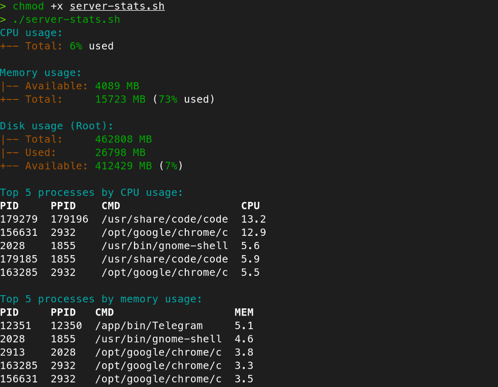

# server-performance-stats 

## A simple Bash script that displays server performance statistics:

- Total CPU usage
- Total memory usage (free vs used)
- Disk usage for root filesystem
- Top 5 processes by CPU usage
- Top 5 processes by memory usage

https://roadmap.sh/projects/server-stats

## Usage

Clone the repository:

```bash
git clone https://github.com/9kraken/server-performance-stats
cd server-performance-stats
```

Make the scripts executable:

```bash
chmod +x server-stats.sh
```

Run the scripts:

```bash
./server-stats.sh
```

## Example output


